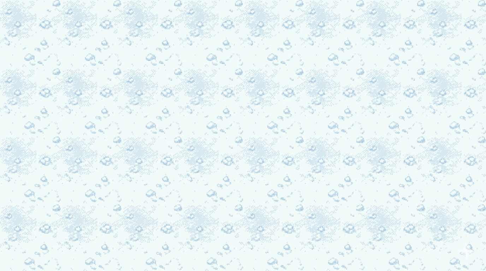

# 🎿 SKI RUSH

## 1. Identificação do Projeto

### 🎮 Título do Projeto

**SKI RUSH**

### 👨‍💻 Desenvolvedor

**Guilherme Rech**

### 🖼️ Logotipo / Banner

<p align="center">
  
</p>

---

## 2. Visão Geral do Sistema

### 📌 Descrição

O **SKI RUSH** é um jogo 2D desenvolvido em **JavaScript puro utilizando HTML5 Canvas**, onde dois jogadores competem ou cooperam para sobreviver desviando de obstáculos em um cenário de neve.

---

### 🎯 Objetivo

O objetivo do jogo é sobreviver o máximo possível, desviando de obstáculos e acumulando pontos enquanto o nível de dificuldade aumenta progressivamente.

---

### ❄️ Tema

O jogo possui temática de **ski na neve**, com ambientação em montanhas geladas.
Os jogadores controlam esquiadores que devem evitar obstáculos e avançar pelas fases até alcançar a vitória.

---

### 🎮 Instruções de Jogabilidade

| Jogador | Controles                  |
| ------- | -------------------------- |
| 🟥 P1   | `W` (subir) / `S` (descer) |
| 🟦 P2   | `↑` (subir) / `↓` (descer) |

**Mecânicas:**

* Desviar de obstáculos
* Coletar bolas de neve
* Sobreviver com base nas vidas
* Acumular pontos

---

### ⚙️ Especificações Técnicas

**Sistema de Vidas:**

* Cada jogador começa com **5 vidas**
* Ao colidir:

  * perde 1 vida
  * ganha invencibilidade temporária
* Ao coletar **bola de neve**:

  * ganha **+1 vida**

**Pontuação:**

* +5 pontos ao desviar de obstáculos
* +10 pontos ao coletar bolas de neve
* Pontuação compartilhada entre os jogadores

**Progressão de Fases:**

| Fase       | Pontos | Descrição                            |
| ---------- | ------ | ------------------------------------ |
| 1          | 0      | Velocidade inicial                   |
| 2          | 200    | Aumento de velocidade + novo cenário |
| 3          | 400    | Alta velocidade                      |
| 🏆 Vitória | 600    | Final do jogo                        |

---

### 👥 Créditos

* **Desenvolvedor:** Guilherme Rech
* **Product Owner (Professor):** Carlos

---

### 🌐 Link de Produção

[https://jogo-ski.vercel.app]

---

## 3. Instruções de Instalação e Execução

### 📥 1. Clonagem

```bash
git clone https://github.com/GuilhermeRech08/jogo_ski.git
cd jogo_ski
```

---

### 📦 2. Instalação de Dependências

*(Não possui dependências externas, pois é JavaScript puro)*

```bash
npm install
```

---

### ▶️ 3. Execução do Projeto

Abra o arquivo:

```bash
index.html
```

no navegador
ou utilize uma extensão como Live Server.

---

### 🚀 4. Link em Produção (Vercel)

*(Adicionar após deploy)*
Exemplo:

```
https://jogo-ski.vercel.app
```

---

## 🧱 Estrutura do Projeto

```
jogo_ski/
│
├── img/
├── index.html
├── script.js
└── style.css
```

---

## 🖥️ Interface do Jogo

* Menu inicial
* HUD com:

  * vidas ❤️
  * pontuação
  * fase atual
* Tela de:

  * Game Over
  * Vitória

---

## 🛠️ Tecnologias Utilizadas

* JavaScript (ES6)
* HTML5 Canvas
* CSS

---

## 📄 Licença

Este projeto está sob a licença MIT.
